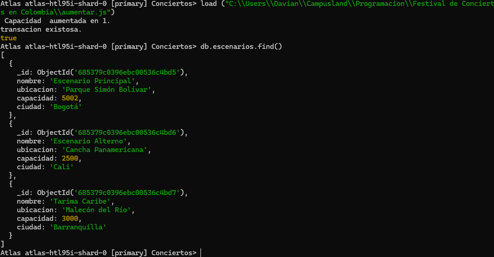

# Bienvenidos a esta coleccion de base de datos NoSQL

## Insersion de datos

### Primero:

 - Abrir la terminal y conectarse a mongoAtlas a traves de comandos por consola


### Segundo:

- usar una nueva base de datos y añadir las siguientes colleciones con sus documentos respectivos
```javascript
    use Conciertos 
```
```javascript

// Insercions de bandas
db.bandas.insertMany([
  { nombre: "Aterciopelados", genero: "Rock", pais_origen: "Colombia", miembros: ["Andrea Echeverri", "Héctor Buitrago"], activa: true },
  { nombre: "Bomba Estéreo", genero: "Electro Tropical", pais_origen: "Colombia", miembros: ["Li Saumet"], activa: true },
  { nombre: "Systema Solar", genero: "Fusión", pais_origen: "Colombia", miembros: ["DJ Corpas", "John Pri"], activa: false },
  { nombre: "ChocQuibTown", genero: "Hip Hop", pais_origen: "Colombia", miembros: ["Goyo", "Tostao", "Slow Mike"], activa: true },
  { nombre: "Monsieur Periné", genero: "Pop Fusión", pais_origen: "Colombia", miembros: ["Catalina García", "Santiago Prieto"], activa: true }
]);

// Insercions de escenarios
db.escenarios.insertMany([
  { nombre: "Escenario Principal", ubicacion: "Parque Simón Bolívar", capacidad: 5000, ciudad: "Bogotá" },
  { nombre: "Escenario Alterno", ubicacion: "Cancha Panamericana", capacidad: 2500, ciudad: "Cali" },
  { nombre: "Tarima Caribe", ubicacion: "Malecón del Río", capacidad: 3000, ciudad: "Barranquilla" }
]);

//Insercions de presentaciones
db.presentaciones.insertMany([
  { banda: "Aterciopelados", escenario: "Escenario Principal", hora: ISODate("2025-06-18T20:00:00Z"), duracion_minutos: 90, asistencia_estimadada: 4500 },
  { banda: "Bomba Estéreo", escenario: "Escenario Alterno", hora: ISODate("2025-06-19T22:00:00Z"), duracion_minutos: 75, asistencia_estimadada: 2300 },
  { banda: "Systema Solar", escenario: "Tarima Caribe", hora: ISODate("2025-06-20T21:00:00Z"), duracion_minutos: 80, asistencia_estimadada: 2800 },
  { banda: "ChocQuibTown", escenario: "Tarima Caribe", hora: ISODate("2025-06-21T20:30:00Z"), duracion_minutos: 70, asistencia_estimadada: 3000 },
  { banda: "Monsieur Periné", escenario: "Escenario Principal", hora: ISODate("2025-06-22T19:00:00Z"), duracion_minutos: 85, asistencia_estimadada: 4200 }
]);

//Insercion de asistentes
db.asistentes.insertMany([
  {
    nombre: "Juan Pérez",
    edad: 27,
    ciudad: "Medellín",
    generos_favoritos: ["Rock", "Indie"],
    boletos_comprados: [
      { escenario: "Escenario Principal", dia: "2025-06-18" },
      { escenario: "Escenario Principal", dia: "2025-06-22" }
    ]
  },
  {
    nombre: "María Gómez",
    edad: 34,
    ciudad: "Bogotá",
    generos_favoritos: ["Electro Tropical"],
    boletos_comprados: [
      { escenario: "Escenario Alterno", dia: "2025-06-19" }
    ]
  },
  {
    nombre: "Carlos Martínez",
    edad: 22,
    ciudad: "Cali",
    generos_favoritos: ["Fusión", "Hip Hop"],
    boletos_comprados: [
      { escenario: "Tarima Caribe", dia: "2025-06-20" }
    ]
  },
  {
    nombre: "Luisa Quintero",
    edad: 29,
    ciudad: "Barranquilla",
    generos_favoritos: ["Pop Fusión", "Rock"],
    boletos_comprados: [
      { escenario: "Escenario Principal", dia: "2025-06-22" }
    ]
  }
]);


```


## Consultas

### Expresiones regulares

- Buscar bandas cuyo nombre empiece por la letra “A”.

```javascript
db.bandas.find({nombre:{$regex:"^[aA]"} })
```
- Respuesta de consola


- Buscar asistentes cuyo nombre contenga "Gómez".

```javascript
db.asistentes.find({nombre:{$regex:"Gómez"} })
```
- Respuesta de consola


### Operadores de Arreglos

- Buscar asistentes que tengan "Rock" dentro de su campo generos_favoritos.

```javascript
db.asistentes.find({generos_favoritos:{$in:["Rock"]}})
```
- Respuesta de consola


- Agrupar presentaciones por escenario y contar cuántas presentaciones hay por cada uno.

```javascript
 db.presentaciones.aggregate([{ $group:{_id:"$escenario",cantidad_presentaciones:{$sum:1} } }])
```
- Respuesta de consola 


- Calcular el promedio de duración de las presentaciones.
```javascript
db.presentaciones.aggregate([  { $group: {  _id: null, promedioDuracion: { $avg: "$duracion_minutos" } } } ])
```
- Respuesta de consola


### Funciones en system.js

- Crear una función llamada escenariosPorCiudad(ciudad) que devuelva todos los escenarios en esa ciudad.


```javascript
db.system.js.insertOne({_id: "escenariosPorCiudad", value:new Code ("function (genero) {var a = db.bandas.find({ genero: genero },{nombre:1});  return a;}" )});

const f1 = db.system.js.findOne({_id:"escenariosPorCiudad"})

const escenarios = new Function("return "+f1.value.code)();

escenarios("Cali")
```

- Respuesta de consola


- Crear una función llamada bandasPorGenero(genero) que devuelva todas las bandas activas de ese género.

```javascript
db.system.js.insertOne({_id: "bandasPorGenero", value:new Code ("function (genero) {const a = db.bandas.find({ genero: genero },{nombre:1});  return a;}" )});

const f2 = db.system.js.findOne({_id:"bandasPorGenero"});

const generos = new Function("return "+f2.value.code)();

generos("Rock")
```

- Respuesta de consola


### Transacciones (requiere replica set)

- Insertar nuevo boleto en boletos_comprados de un asistente.

```javascript
const session = db.getMongo().startSession();
const dbSession = session.getDatabase("asistentes");
session.startTransaction();

try {

    function agregarAsistente() {
    const nuevoAsistente = {
        nombre: "Ana Torres",
        edad: 31,
        ciudad: "Cartagena",
        generos_favoritos: ["Cumbia", "Electro Tropical"],
        boletos_comprados:  [
            { escenario: "Tarima Caribe", dia: "2025-06-21" },
            { escenario: "Escenario Alterno", dia: "2025-06-22" }
  ]
    };

  db.asistentes.insertOne(nuevoAsistente);

}

    agregarAsistente();
    print(`Asistente agregado con éxito.`);
    session.commitTransaction();
} catch (error) {
    session.abortTransaction();
    print("Error:", e);
}finally{
    session.endSession();
    
}
```
- Respuesta de consola


- Disminuir en 1 la capacidad del escenario correspondiente.
```javascript
const session = db.getMongo().startSession();
const dbSession = session.getDatabase("escenarios");
session.startTransaction();

try {

function disminuirCapacidadEscenario() {
  const resultado = db.escenarios.updateOne(
    { nombre: "Escenario Principal", capacidad: { $gt: 0 } },
    { $inc: { capacidad: -1 } }
    );

    if (resultado.modifiedCount === 1) {
        print(` Capacidad  disminuida en 1.`);
    } else {
        print(` No se pudo disminuir la capacidad.`);
    }
    };
     disminuirCapacidadEscenario();
    print(`transacion existosa.`);
    session.commitTransaction();
} catch (error) {
    session.abortTransaction();
    print("Error:", e);
}finally{
    session.endSession();
    
}

```


- Respuesta de consola 


```javascript
db.asistentes.deleteOne({ nombre: "Ana Torres" })
```
- Respuesta de consola


- Incrementar la capacidad del escenario.


```javascript
const session = db.getMongo().startSession();
const dbSession = session.getDatabase("escenarios");
session.startTransaction();

try {

function disminuirCapacidadEscenario() {
  const resultado = db.escenarios.updateOne(
    { nombre: "Escenario Principal", capacidad: { $gt: 0 } },
    { $inc: { capacidad: 1 } }
    );

    if (resultado.modifiedCount === 1) {
        print(` Capacidad  aumentada en 1.`);
    } else {
        print(` No se pudo aumentada la capacidad.`);
    }
    };
     disminuirCapacidadEscenario();
    print(`transacion existosa.`);
    session.commitTransaction();
} catch (error) {
    session.abortTransaction();
    print("Error:", e);
}finally{
    session.endSession();
    
}
```

- respuesta de consola


